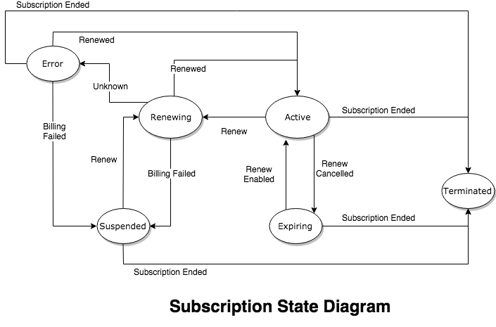

# django-subscriptions

A django package for managing the status and terms of a subscription.

[](https://badge.fury.io/py/django-subscriptions)
[](https://circleci.com/gh/kogan/django-subscriptions)
[](https://github.com/ambv/black)


## Compatibility

- Django: 1.11 and 2.2 (LTS versions only)
- Python: 2.7 and 3.6+

Other Django or Python versions **may** work, but that is totally cooincidental
and no effort is made to maintain compatibility with versions other than those
listed above.

## Installation

```bash
$ pip install django-subscriptions
```

Then add the following packages to `INSTALLED_APPS` in your settings:

```
INSTALLED_APPS = [
    ...
    "django_fsm_log",
    "subscriptions.apps.SubscriptionsConfig",
    ...
]
```

And of course, you'll need to run the migrations:

```
$ python manage.py migrate
```

You'll also need to setup the triggers, which can be scheduled with celery or
run from a management task. See the [Triggers](#triggers) section below.

## Design

Manages subscriptions in a single table. Pushes events (signals) so that
consumers can do the actual work required for that subscription, like billing.

Subscriptions are built around a Finite State Machine model, where states and
allowed transitions between states are well defined on the Model. To update from
one state to another, the user calls methods on the Subscription instance. This
way, all side-effects and actions are contained within the state methods.

Subscription State must not be modified directly.

When a state change is triggered, the subscription will publish relevant signals
so that interested parties can, themselves, react to the state changes.



## API

There are 3 major API components. State change methods, signals/events, and the
triggers used to begin the state changes.

### State Methods


| Method                                         | Source States                   	| Target State 	| Signal Emitted       	|
|------------------------------------------------|---------------------------------	|--------------	|----------------------	|
| `cancel_autorenew()`                           | ACTIVE                          	| EXPIRING     	| `autorenew_canceled` 	|
| `enable_autorenew()`                           | EXPIRING                        	| ACTIVE       	| `autorenew_enabled`  	|
| `renew()`                                      | ACTIVE,SUSPENDED                	| RENEWING     	| `subscription_due`   	|
| `renewed(new_end, new_ref, description=None)`  | ACTIVE,RENEWING,ERROR            | ACTIVE       	| `subscription_renewed`|
| `renewal_failed(description=None)`	         | RENEWING,ERROR                  	| SUSPENDED    	| `renewal_failed`     	|
| `end_subscription(description=None)`           | ACTIVE,SUSPENDED,EXPIRING,ERROR 	| ENDED        	| `subscription_ended` 	|
| `state_unknown(description=None)`	             | RENEWING                        	| ERROR        	| `subscription_error` 	|

Example:

`subscription.renew()` may only be called if `subscription.state` is either `ACTIVE` or `SUSPENDED`,
and will cause `subscription.state` to move into the `RENEWING` state.

The `description` argument is a string that can be used to persist the reason for a state
change in the `StateLog` table (and admin inlines).

### Triggers

There are a bunch of triggers that are used to update subscriptions as they become
due or expire. Nothing is configured to run these triggers by default. You can
either call them as part of your own process, or use `celery beat` to execute
the triggers using the tasks provided in `subscriptions.tasks`.


Create a new subscription:

```
Subscription.objects.add_subscription(start_date, end_date, reference) -> Subscription
```

Trigger subscriptions that are due for renewal:

```
Subscription.objects.trigger_renewals() -> int  # number of renewals sent
```

Trigger subscriptions that are due to expire:

```
Subscription.objects.trigger_expiring() -> int  # number of expirations
```

Trigger subscriptions that are suspended:

```
Subscription.objects.trigger_suspended() -> int  # number of renewals
```

Trigger subscriptions that have been suspended for longer than `timeout_hours` to
end (uses `subscription.end` date, not `subscription.last_updated`):

```
Subscription.objects.trigger_suspended_timeout(timeout_hours=48) -> int  # number of suspensions
```

Trigger subscriptions that have been stuck in renewing state for longer than `timeout_hours`
to be marked as an error (uses `subscription.last_updated` to determine the timeout):

```
Subscription.objects.trigger_stuck(timeout_hours=2) -> int  # number of error subscriptions
```


### Tasks

The following tasks are defined but are not scheduled:

```
subscriptions.tasks.trigger_renewals
subscriptions.tasks.trigger_expiring
subscriptions.tasks.trigger_suspended
subscriptions.tasks.trigger_suspended_timeout
subscriptions.tasks.trigger_stuck
```

If you'd like to schedule the tasks, do so with a celery beat configuration like this:

```
# settings.py

CELERYBEAT_SCHEDULE = {
    "subscriptions_renewals": {
        "task": "subscriptions.tasks.trigger_renewals",
        "schedule": crontab(hour=0, minute=10),
    },
    "subscriptions_expiring": {
        "task": "subscriptions.tasks.trigger_expiring",
        "schedule": crontab(hour=0, minute=15),
    },
    "subscriptions_suspended": {
        "task": "subscriptions.tasks.trigger_suspended",
        "schedule": crontab(hour="3,6,9", minute=30),
    },
    "subscriptions_suspended_timeout": {
        "task": "subscriptions.tasks.trigger_suspended_timeout",
        "schedule": crontab(hour=0, minute=40),
        "kwargs": {"hours": 48},
    },
    "subscriptions_stuck": {
        "task": "subscriptions.tasks.trigger_stuck",
        "schedule": crontab(hour="*/2", minute=50),
        "kwargs": {"hours": 2},
    },
}
```

## Contributing

We use `pre-commit <https://pre-commit.com/>` to enforce our code style rules
locally before you commit them into git. Once you install the pre-commit library
(locally via pip is fine), just install the hooks::

    pre-commit install -f --install-hooks

The same checks are executed on the build server, so skipping the local linting
(with `git commit --no-verify`) will only result in a failed test build.

Current style checking tools:

- flake8: python linting
- isort: python import sorting
- black: python code formatting

Note:

    You must have python3.6 available on your path, as it is required for some
    of the hooks.


## Generating Migrations

After installing all dependencies, you can generate required migration files
like so:

```bash
$ poetry run ipython migrate.py <nameofmigration>
```


## Publishing a new version

1. Bump the version number in pyproject.toml and src/subscriptions/init.py
2. Commit and push to master
3. From github, [create a new release](https://github.com/kogan/django-subscriptions/releases)
4. Name the release "v<maj.minor.patch>" using the version number from step 1.
5. Publish the release
6. If the release successfully builds, circleci will publish the new package to pypi
